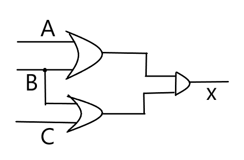

# Gates and Circuits

## Part1

### 1) Give the three representations of an AND gate and say in your words what AND means. 

Boolean Expression:   x=A · B

Logic Diagram Symbol:

Truth Table:

A |B |X |
-| -| -|
0 |0|0|
0| 1|0
1|0|0
1|1|1

当输入端都为1（高电平）时，输出端才为1，否则输出端为0（低电平）。

### 2) Give the three representations of an XOR gate and say in your words what XOR means. 

Bloolean Expression:  x=A·B'+A'·B

Logic Diagram Symbol:

Truth Table:

A|B|x|
-|-|-|
0|0|0
1|0|1
0|1|1
1|1|0

当所有输入端全为1（高电平）或全为0（低电平）时，输出端为0，否则为1。

### 3) Draw a circuit diagram corresponding to the following Boolean expression: (A + B)(B + C) 

### 4) Show the behavior of the following circuit with a truth table:

A|B|A'|C|x
-|-|-|-|-|
0|0|1|0|1
0|1|1|0|1
1|0|0|0|0
1|1|0|1|1

### 5) What is circuit equivalence? Use truth table to prove the following formula. (AB)’ = A’ + B’

circuit equivalence（电路等价）：输入与输出完全相等

x=（AB）’

A|B|AB|x
-|-|-|-|
0|0|0|1 
0|1|0|1
1|0|0|1
1|1|1|0

x=A'+B'

A|B|A'|B'|x
-|-|-|-|-|
0|0|1|1|1
0|1|1|0|1
1|0|0|1|1
1|1|0|0|0

故：(AB)’ = A’ + B’

### 6) There are eight 1bit full adder integrated circuits. Combine them to 8bit adder circuit using the following box diagram.

### 7) Logical binary operations can be used to modify bit pattern. Such as (X8X7X6X5X4X3X2X1)2 and (00001111)2= (0000X4X3X2X1)2 We called that (00001111)2 is a mask which only makes low 4 bits to work. Fill the follow expression

(1)  (X8X7X6X5X4X3X2X1)2 or (00001111)2 = (           )2 

(2)  (X8X7X6X5X4X3X2X1)2 xor (00001111)2 = (           )2 

(3)  ((X8X7X6X5X4X3X2X1)2 and(11110000)2 ) 

or  (not (X8X7X6X5X4X3X2X1)2 and (00001111)2)  =  (           )2

## Part 2

### 1.使用维基百科，解释以下概念。 

1)Logic gate 

In electronics, a logic gate is an idealized or physical device implementing a Boolean function; that is, it performs a logical operation on one or more binary inputs and produces a single binary output. 

2)Boolean algebra

In mathematics and mathematical logic, Boolean algebra is the branch of algebra in which the values of the variables are the truth values true and false, usually denoted 1 and 0 respectively. Instead of elementary algebra where the values of the variables are numbers, and the prime operations are addition and multiplication, the main operations of Boolean algebra are the conjunction and denoted as ∧, the disjunction or denoted as ∨, and the negation not denoted as ¬. It is thus a formalism for describing logical relations in the same way that elementary algebra describes numeric relations.

### 自学存储电路。

1)Flip-flop (触发器)

2）How many bits information does a SR latch store?

