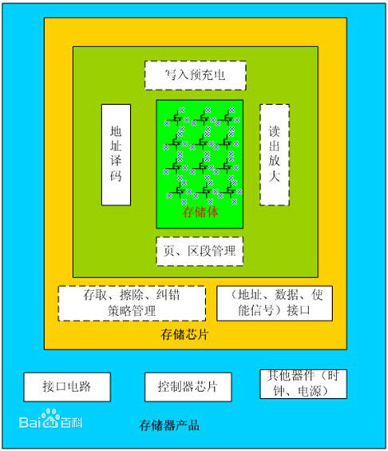

# Programming Barely

## 1、Program with machine language according to the following c. 

int_8 a = 1;  
int_8 c = a + 3;  

### 1）Write your assembly code and machine code.

**Assembly code:**

*//定义数据段*

DATA SEGMENT

a DB 01H

c DB

DATA ENDS

*//定义代码段*

CODE SEGMENT

START:

LOD a

ADD #1

STO c

CODE ENDS

END START 

**Machine Code:**

00000000 aaaaaaaa

00010001 00000011

00000001 cccccccc

### 2）Explain machine code execution with the fetch-decode-execute cycle. 

1.Fetch the next instruction

下一条指令从当前存储在程序计数器中的存储器地址中取出，并存储到指令寄存器中。PC指向下一个指令。

2.Decode the instruction

解码器解释存在于指令寄存器中的编码指令。

3.Get data if needed

如果指令有间接地址，从主存储器读取有效地址并取出数据进行处理，然后放入数据寄存器。如果指令是直接指令，则在此期间不执行任何操作。如果这是I / O指令或寄存器指令，则在此期间执行操作。

4.Execute the instruction

CPU的控制单元将解码后的信息作为一系列控制信号传递给CPU的相关功能单元，以执行指令所需的动作，操作生成的结果存储在主存储器中或发送到输出设备。

### 3）Explain functions about  IR, PC, ACC registers in a CP.

IR：即指令寄存器，其功能是存放当前正在执行的指令。

PC：即程序计数器，其功能是存放当前欲执行指令的地址，并可自动计数形成下一条指令地址。

ACC：即累加器，其功能是存放运算前的操作数，并可以存放运算结果。

### 4）Explain physical meaning about vars a and c in a machine.

a和c是变量名，代表了它们所占的内存单元的地址。

## 2.简答题

### 1）What are stored in memory? 

计算机中全部信息，包括输入的原始数据、计算机程序、中间运行结果和最终运行结果都保存在存储器中。

### 2）Can a data or a instruction stored in the same place? 

计算机中的指令和数据可以存放在相同的位置。冯. 诺依曼结构中二者存放在相同位置，而在哈佛结构中二者被分开存储。

### 3） Explain Instruction Format with example instructions.

Example:00000000 bbbbbbbb

其中前八位是指令说明符，后八位是操作数说明符。

指令说明符前三位全为0，第四位是寻址模式，如果是0，代表着后面一个字节是一个地址，操作数就是这个地址所含有的数据；如果是1，代表着后面一个字节表示一个确切的数值，也就是操作数。

第一个字节的后四位是操作码，不同的操作码有不同的二进制表示，如0000表示load,0001表示store。

## 3、解释以下词汇

 1）汇编语言（Assembly Language） 
 
 汇编语言（assembly language）是一种用于电子计算机、微处理器、微控制器或其他可编程器件的低级语言，亦称为符号语言。在汇编语言中，用助记符（Mnemonics）代替机器指令的操作码，用地址符号（Symbol）或标号（Label）代替指令或操作数的地址。在不同的设备中，汇编语言对应着不同的机器语言指令集，通过汇编过程转换成机器指令。普遍地说，特定的汇编语言和特定的机器语言指令集是一一对应的,不同平台之间不可直接移植。

 2）编译（Compiler） 

利用编译程序从源语言编写的源程序产生目标程序的过程。 用编译程序产生目标程序的动作。 

编译就是把高级语言变成计算机可以识别的2进制语言，计算机只认识1和0，编译程序把人们熟悉的语言换成2进制的。 编译程序把一个源程序翻译成目标程序的工作过程分为五个阶段：词法分析；语法分析；语义检查和中间代码生成；代码优化；目标代码生成。主要是进行词法分析和语法分析，又称为源程序分析，分析过程中发现有语法错误，给出提示信息。

 
 
 3）命令式语言（Imperative programming） 

 In computer science, imperative programming is a programming paradigm that uses statements that change a program's state. In much the same way that the imperative mood in natural languages expresses commands, an imperative program consists of commands for the computer to perform. Imperative programming focuses on describing how a program operates.
 
 4）函数编程语言（Functional programming） 
 
 函数式编程是种编程方式，它将电脑运算视为函数的计算。函数编程语言最重要的基础是λ演算（lambda calculus），而且λ演算的函数可以接受函数当作输入（参数）和输出（返回值）。 和指令式编程相比，函数式编程强调函数的计算比指令的执行重要。和过程化编程相比，函数式编程里函数的计算可随时调用。

 5）过程式编程（Procedural programming）

一种编程典范，派生自结构化编程，主要采取程序调用或函数调用的方式来进行流程控制。流程则由包涵一系列运算步骤的程序，例程，子程序, 方法，或函数来控制。在程序运行的任何一个时间点，都可以调用某个特定的程序。任何一个特定的程序，也能被任意一个程序或是它自己本身调用。