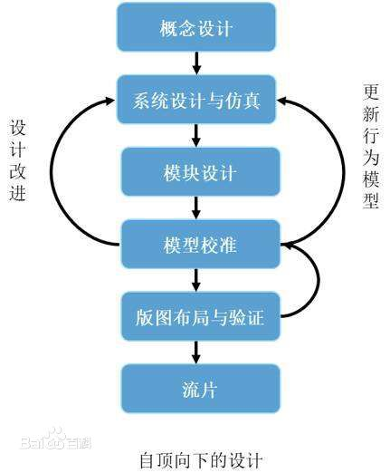
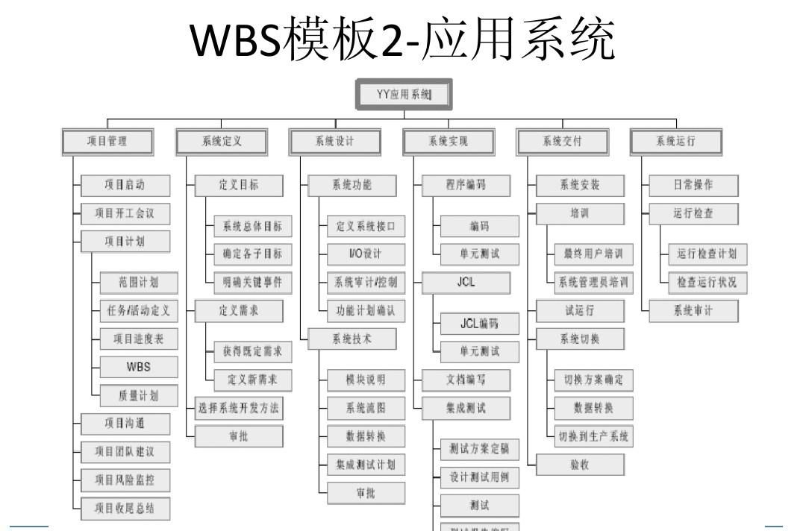

#
## 1、阅读 PseudocodeStandard。 

### 1）用伪代码描述将十进制转换成16进制的方法 

```
FUNCTION translate(number)

SET a to number%16

IF number>=16 THEN
translate(number)
ENDIF

CASE a OF
   10    :PRINTF "A"
   11    :PRINTF "B"
   12    :PRINTF "C"
   13    :PRINTF "D"
   14    :PRINTF "E"   
   15    :PRINTF "F"  
   OTHERS:PRINTF (a)
END CASE

ENDFUNCTION

READ number
DO translate(number)

```

### 2）C语言实现（先用注释写好算法，然后翻译） 

```
#include <stdio.h>
int main(){
	int number;
	void translate(int number);
	
	scanf("%d",&number);
	
	translate(number);
	
} 

void translate(int number){
	int a;
	
	a=number%16;
	
	if(number>16)
	translate(number/16);
	
	switch(a) {
    case 10:
        printf("A");
        break;
    case 11:
        printf("B");
        break;
    case 12:
        printf("C");
        break;
    case 13:
        printf("D");
        break;
    case 14:
        printf("E");
        break;
    case 15:
        printf("F");
        break;
    default:
        printf("%d", a);
  } 
} 

```

### 3）使用 -1,  0,  1,  15,   26，3265 为输入测试你的程序
input |output
-| :-: | 
-1 | -1
0|0
1|1
15|F
26|1A
3265|CC1


## 2、名词解释与对比 

### 1）Top-down design 

自顶向下（top-down）的分析算法通过在最左推导中描述出各个步骤来分析记号串输入。将大型的数字电路设计分割成大小不一的小模块来实现特定的功能，最后通过由顶层模块调用子模块来实现整体功能，这就是Top-Down的设计思想。



### 2） Work breakdown structure (WBS) 

工作分解结构（Work Breakdown Structure） 创建WBS：创建WBS是把项目 交付成果和项目工作分解成较小的，更易于管理的组成部分的过程。
WBS是项目管理重要的专业术语之一。WBS的基本定义 ：以可交付成果为导向对项目要素进行的分组，它归纳和定义了项目的整个工作范围每下降一层代表对项目工作的更详细定义。无论在项目管理实践中，还是在PMP，IPMP考试中，工作分解结构（WBS）都是最重要的内容之一。WBS总是处于计划过程的中心，也是制定进度计划、资源需求、成本预算、风险管理计划和采购计划等的重要基础。WBS同时也是控制项目变更的重要基础。项目范围是由WBS定义的，所以WBS也是一个项目的综合工具。



### 3）简述管理学WBS 与 信息学Top-down设计 的异同

同：都是将一个系统拆分成多个小部分

异：Top-down由上到下拆分，WBS根据不同类别分成小的部分


## 3、仔细观察您洗衣机的运作过程，运用Top-down设计方法和Pseudocode 描述洗衣机控制程序。
假设洗衣机可执行的基本操作如下： 
water_in_switch(open_close)  // open 打开上水开关，close关闭

 water_out_switch(open_close)  // open 打开排水开关，close关闭 
 
 get_water_volume()  //返回洗衣机内部水的高度

motor_run(direction) // 电机转动。left左转，right右转，stop停 

time_counter()  // 返回当前时间计数，以秒为单位 

halt(returncode) //停机，success 成功 failure 失败

1）请使用伪代码分解“正常洗衣”程序的大步骤。包括注水、浸泡等 

1.获取模式要求数据

2.注水

3.浸泡

4.电机转动洗衣服

5.排水

6.脱水

7.关机


2）进一步用基本操作、控制语句（IF、FOR、WHILE等）、变量与表达式，写出每个步骤的伪代码 
```

READ hight,time1,time2        //1.获取模式要求数据

water_in_switch(open)         //2.注水
WHILE 水位<hight
ENDWHILE
waterinswitch(close)

浸泡                          //3.浸泡
WHILE 时间1<time1
ENDWHILE

WHILE 时间2<time2            //4.洗衣
motorun(left)
motorun(right)
ENDWHILE
motorun(stop)

WHILE 水位>0                 //5.排水
wateroutswitch(open)
ENDWHILE
wateroutswitch(close)

WHLILE 时间3<time3            //6.脱水
  motorrun(left)
  motorrun(right)
ENDWHILE
    motorrun(stop)

    halt(success)              //7.关机

```

3）根据你的实践，请分析“正常洗衣”与“快速洗衣”在用户目标和程序上的异同。 你认为是否存在改进（创新）空间，简单说明你的改进意见？ 

快速洗衣相较于正常洗衣要求的用时更短，因而没有浸泡的步骤。


4）通过步骤3），提取一些共性功能模块（函数），简化“正常洗衣”程序，使程序 变得更利于人类理解和修改维护。例如： wait(time) //等待指定的时间； 注水(volume,timeout) //在指定时间内完成注水，否则停机； 排水(timeout)。等子程序


