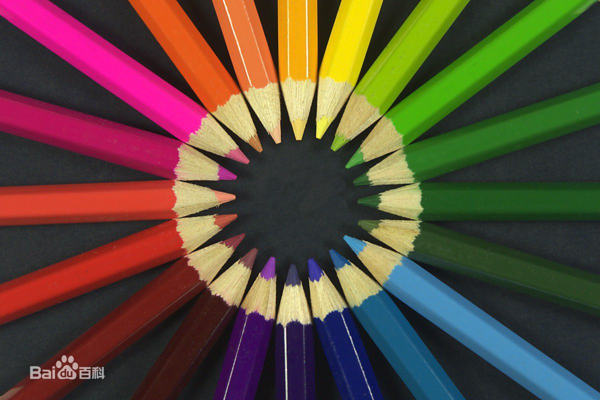
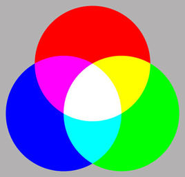
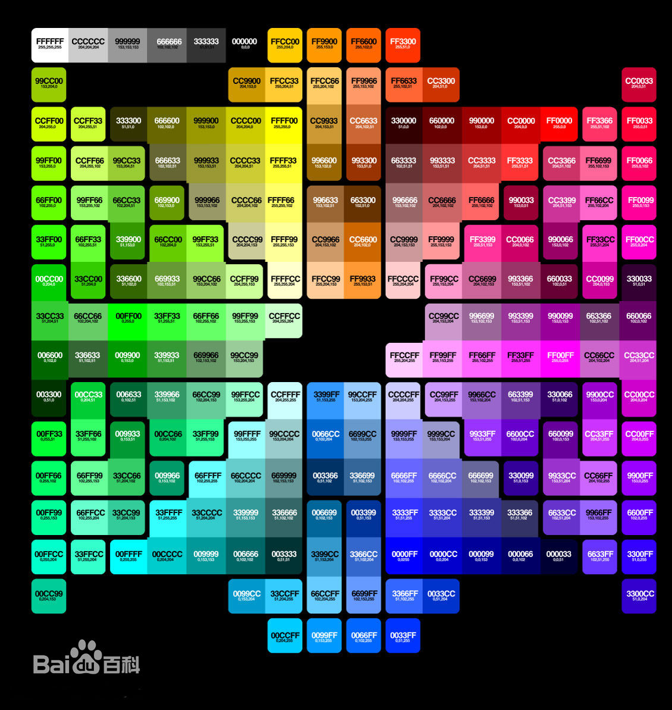
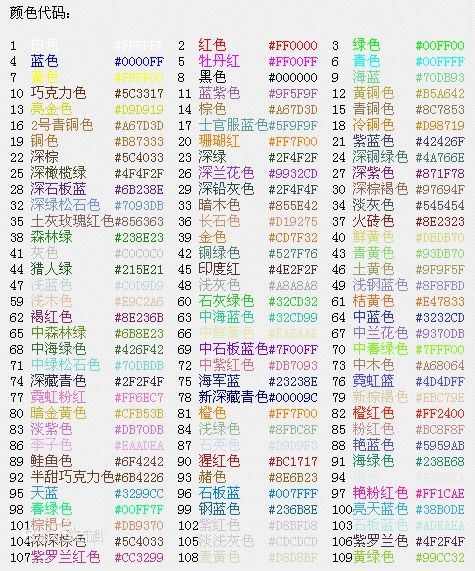

# 色彩表示与编码

## 颜色

色彩是能引起我们共同的审 美愉悦的、最为敏感的形式要素。色彩是最有表现力的要素之一，因为它的性质直接影响人们的感情。丰富多样的颜色可以分成两个大类无彩色系和有彩色系，有彩色系的颜色具有三个基本特性：色相、纯度（也称彩度、饱和度）、明度。在色彩学上也称为色彩的三大要素或色彩的三属性。饱和度为0的颜色为无彩色系。

## 色光三原色

色光三原色（加法三原色）为：红、绿、蓝。光线会越加越亮，两两混合可以得到更亮的中间色：yellow黄、magenta品红（或者叫洋红、紫）、cyan青。三种等量组合可以得到白色。

## 颜色的RGB数字表示方法

### RGB概念
RGB色彩模式是工业界的一种颜色标准，是通过对红(R)、绿(G)、蓝(B)三个颜色通道的变化以及它们相互之间的叠加来得到各式各样的颜色的，RGB即是代表红、绿、蓝三个通道的颜色，这个标准几乎包括了人类视力所能感知的所有颜色，是目前运用最广的颜色系统之一。

### 原理

RGB是从颜色发光的原理来设计定的，通俗点说它的颜色混合方式就好像有红、绿、蓝三盏灯，当它们的光相互叠合的时候，色彩相混，而亮度却等于两者亮度之总和，越混合亮度越高，即加法混合。
 
红、绿、蓝三盏灯的叠加情况，中心三色最亮的叠加区为白色，加法混合的特点：越叠加越明亮。

红、绿、蓝三个颜色通道每种色各分为256阶亮度，在0时“灯”最弱——是关掉的，而在255时“灯”最亮。当三色灰度数值相同时，产生不同灰度值的灰色调，即三色灰度都为0时，是最暗的黑色调；三色灰度都为255时，是最亮的白色调。

RGB 颜色称为加成色，因为您通过将 R、G 和 B 添加在一起（即所有光线反射回眼睛）可产生白色。加成色用于照明光、电视和计算机显示器。例如，显示器通过红色、绿色和蓝色荧光粉发射光线产生颜色。绝大多数可视光谱都可表示为红、绿、蓝 (RGB) 三色光在不同比例和强度上的混合。这些颜色若发生重叠，则产生青、洋红和黄。

### 常见颜色的RGB值

颜色 | Red | Green | Blue
-| :-: | :-: | :-:
白色 | 255 | 255 | 255
黑色 | 0 | 0| 0
红色 | 255| 0| 0
绿色 | 0| 255 |0
蓝色 |0 | 0| 255
黄色 |255| 255| 0
青色|0|255|255
洋红色|255|0|255

## 十六进制颜色码

十六进制颜色码就是在软件中设定颜色值的代码。在很多软件中，都会遇到设定颜色值的问题，发展来源 人的眼睛看到的颜色有两种： 一种是发光体发出的颜色，比如计算机显示器屏幕显示的颜色； 另一种是物体本身不发光，而是反射的光产生 十六进制颜色。

----
**对照表**

