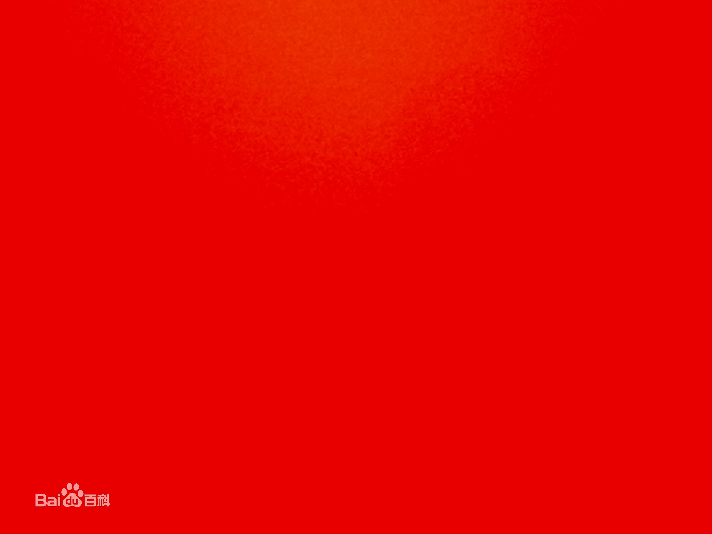

# 用construct2制作躲避小游戏


## 概念

Gameplay：玩家需操控红色方块躲避黑色方块，碰到黑色方块则游戏结束，游戏时间越长，获得分数越高。

Game Sprites：

1.Player：可通过上下左右键移动，初始生命值为3，碰到黑色方块时生命值减少1，当生命值为0时游戏结束。

2.Enemy：随机自由移动，与红色方块相撞时使其生命值减少1.

## 插入对象

### 添加背景

双击布局中的空格以插入新对象。出现Insert New Object对话框后，双击Tiled Background将其插入。 此后将出现一个十字准线，指示放置对象的位置。单击布局中间附近的某个位置。纹理编辑器会立即打开，你可以输入纹理瓷砖。


### 添加图层

管理图层，请单击Layers选项卡，该选项卡通常位于Projects栏旁边。
单击铅笔图标并将第0层重命名为Background，因为它是我们的背景图层。现在单击绿色的“添加”图标为我们的其他对象添加新图层。我们称之为一个Main。最后，如果单击“ 背景”旁边的小挂锁图标，它将被锁定。这意味着您将无法选择任何内容。这对我们的平铺背景非常方便，这很容易被意外选择，不需要再次触摸。但是，如果您需要进行更改，只需再次单击挂锁即可解锁。现在，确保在图层栏中选择了“Main”图层。

### 添加游戏对象

双击以插入新对象，双击 “Sprite”对象。当鼠标变为十字准线时，单击布局中的某个位置。工具提示应为“Main”。（请记住这是活动布局。）弹出纹理编辑器。单击打开图标，然后加载四个纹理中的一个。关闭纹理编辑器，保存更改。




## CRC（Class-Responsibility-Collaboration）卡片

```
+-----------------------------------+
|Object Name  ： Player             |
+-----------------------------------+
|Attributes : sprite,Main Layer     |
+-----------------------------------+
|Collaborator   |  Events & Actions |
+-----------------------------------+
| enemy         | collison,health-1 |
+-----------------------------------+
|timer          | add 10 to score   |
|               | every second      |
+-----------------------------------+
|health         | <=0 ,destory      |
+-----------------------------------+
```


```
+-----------------------------------+
|Object Name  :  Enemy              |
+-----------------------------------+
|Attributes  :  sprite,Main Layer   |
+-----------------------------------+
|Collaborator   |   Event & Actions |
+-----------------------------------+
|Enemy          |set angle to 360   |
|               | degree            |
+-----------------------------------+
```
